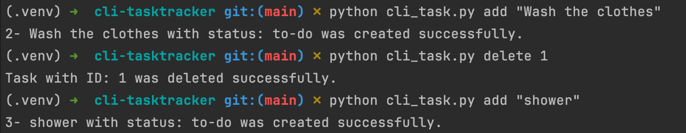
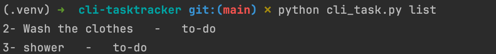
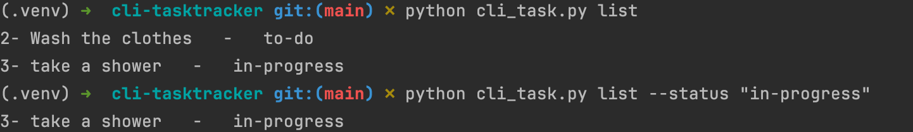
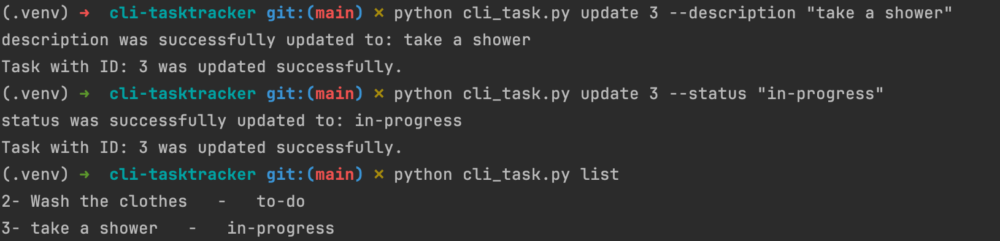
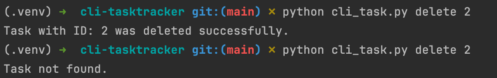

# CLI Task Tracker
A simple Command Line Interface (CLI) tool to help you manage tasks effectively. Task Tracker allows you to add, update, delete, and list tasks. Tasks can also be marked as to-do, in-progress, or done.

### Installing Task Tracker
#### 1. Clone the repository:
    git clone git@github.com:ParvinGhasemi/cli-tasktracker.git
#### 2. Navigate to the project directory using the `cd` command.
#### 3. Create a virtual environment (optional but recommended)
If you don’t have virtualenv installed, you can install it with:`pip install virtualenv`
Then create and activate the virtual environment to use it.
- For Linux/Mac:
```commandline
virtualenv venv
source venv/bin/activate
```
- For windows:
```commandline
python -m venv venv
.\venv\Scripts\activate
```
### Using Task Tracker
To start using Task Tracker, use the following commands:

#### To add a task:
`python cli_task.py add "Your task description here"`
<br>Here's an example:


To list all tasks:
`python cli_task.py list`
<br> Here's an example:


To filter by status:
`python cli_task.py list --status done`
<br> Here's an example:



#### To update a task:
you can update the description of a task or its status.
<br>update the description using:
`python cli_task.py update <id> --description "New description" --status in-progress`

or update the status using:
`python cli_task.py update 1 --description "Go grocery shopping" --status done`
Here's an example:

As you can see above, we successfully have updated the description and the status of a task.
> *Note*: You need to use 2 different commands to update description and status. this cannot happen in one command.

#### To delete a task:
`python cli_task.py delete <id>`
<br>Here's an example:


### Project Link
This was a solution for:
[Task Tracker Project on roadmap.sh](https://roadmap.sh/projects/task-tracker)

